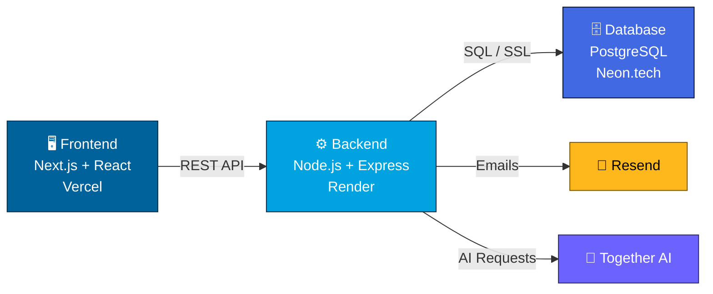

<div align="center">


<br/>


<br/><br/>

[](https://ieeeanu.app)
[](https://ieeeanu.app)
[](https://ieeeanu.app)

</div>


<br/>

## 📖 نظرة عامة

<table>
<tr>
<td>

**IEEE ANU** هي المنصة الرقمية الرسمية للفرع الطلابي لـ **IEEE** في **جامعة عجلون الوطنية**. صُممت بمعمارية Full-Stack منفصلة (Decoupled) توفّر تجربة سريعة، آمنة، وقابلة للتوسع — من إدارة الفعاليات والأعضاء إلى التواصل الآلي عبر البريد الإلكتروني.

</td>
</tr>
</table>

<br/>

## 🧰 التقنيات المستخدمة

<div align="center">

### 🎨 Frontend


| التقنية | الدور |
|:---:|:---|
|  | إطار العمل الأساسي — SSR / SSG وتحسين الأداء وSEO |
|  | بناء واجهات المستخدم بشكل مكوّناتي وتفاعلي |
|  | Type Safety وتقليل الأخطاء البرمجية |
|  | الاستضافة والنشر التلقائي CI/CD |

<br/>

### ⚙️ Backend


| التقنية | الدور |
|:---:|:---|
|  | بيئة تشغيل الخادم |
|  | بناء REST API منظم وقابل للتوسع |
|  | استضافة الباك اند مع Auto-Deploy |

<br/>

### 🗄️ Database & Infra


| التقنية | الدور |
|:---:|:---|
|  | قاعدة بيانات علائقية موثوقة |
|  | Serverless Postgres مع Branching تلقائي |

<br/>

### 🛠️ أدوات وخدمات مساندة

| الأداة | الاستخدام |
|:---:|:---|
|  | إرسال إيميلات معاملاتية (ترحيب، OTP، إشعارات) |
|  | التحقق من النطاق SPF / DKIM |
|  | اختبار الحمل وتحليل الأداء تحت الضغط |
|  | دمج قدرات الذكاء الاصطناعي عبر API |

</div>


<br/>

## 🏗️ البنية التقنية (Architecture)

<div align="center">



</div>

<br/>

## ✨ أبرز الميزات

<table>
<tr>
<td width="50%">

### ⚡ الأداء
- Server-Side Rendering مع Next.js
- Static Generation للصفحات القابلة للتخزين المؤقت
- بنية Serverless سريعة الاستجابة

</td>
<td width="50%">

### 🔐 الأمان
- نظام مصادقة مع OTP عبر البريد
- حل جذري لمشاكل CORS
- Rate Limiting محسّن للحماية من الضغط

</td>
</tr>
<tr>
<td width="50%">

### 📧 التواصل
- قوالب HTML مخصصة بهوية IEEE
- إشعارات جماعية وترحيبية آلية
- تحقق DNS كامل (SPF / DKIM)

</td>
<td width="50%">

### 🚀 النشر
- CI/CD تلقائي على Vercel و Render
- فصل كامل بين الطبقات (Decoupled)
- قابلية توسع عالية

</td>
</tr>
</table>


<br/>

## 📈 الأداء وضمان الجودة

<div align="center">


</div>

تم اختبار الـ API تحت الضغط باستخدام **k6** عبر محاكاة مستخدمين متزامنين، وتبيّن أن **الـ Rate Limiter** هو أكبر عنق زجاجة (Bottleneck) عند الحمل العالي — وتم ضبط إعداداته لتحقيق التوازن الأمثل بين الأمان والأداء.

<br/>

## 📂 هيكلية المشروع

```
ieeeanu/
├── 🖥️ frontend/                 Next.js Application
│   ├── app/                     App Router
│   ├── components/              مكوّنات React قابلة لإعادة الاستخدام
│   ├── lib/                     دوال مساعدة وإعدادات API
│   └── public/                  الأصول الثابتة
│
├── ⚙️ backend/                   Express API
│   ├── src/routes/               مسارات الـ API
│   ├── src/controllers/          منطق التحكم
│   ├── src/middleware/           CORS, Rate Limiting, Auth
│   └── src/services/             Resend, Together AI, DB
│
└── 📄 README.md
```


<br/>

## 🚀 النشر

<div align="center">

| الطبقة | المنصة | التفاصيل |
|:---:|:---:|:---|
| 🖥️ Frontend | **Vercel** | نشر تلقائي عند كل Push للفرع الرئيسي |
| ⚙️ Backend | **Render** | Web Service مع Environment Variables مُدارة |
| 🗄️ Database | **Neon.tech** | PostgreSQL Serverless مع اتصال SSL آمن |

</div>

<br/>

## 👨‍💻 التطوير

<div align="center">

طُوّر ونُشر بالكامل من قبل **محمد المومني**، ضمن نشاطه التقني مع **IEEE ANU Student Branch**

[](https://mohammedalmomani.me)
[](https://github.com/mohmmedalmomani3)

</div>


<div align="center">
<sub>Made with ⚡ for IEEE ANU Student Branch</sub>
</div>
